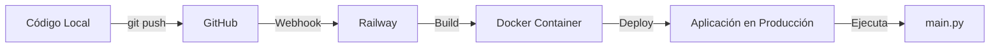

# 📧 Sistema de Emails Automáticos

Guía completa sobre cómo funciona el envío automático de correos en HotBoat Automations.

## 🎯 Resumen Ejecutivo

El sistema envía correos automáticos usando **Resend** (servicio de email moderno). Los correos se envían desde `onboarding@resend.dev` cuando:

1. **Stock bajo**: Producto con inventario bajo el mínimo
2. **Stock crítico**: Producto con 2 o menos unidades
3. **Stock agotado**: Producto sin inventario (0 unidades)
4. **Resúmenes diarios**: Reportes de negocio cada mañana
5. **Resúmenes semanales/mensuales**: Reportes cada lunes

## 📨 Ejemplo de Email (Stock Bajo)

El email que recibiste es del tipo **"Stock Bajo tras Consumo"**:

```
[IMPORTANTE] HotBoat Automations - 08/03/2026 04:23

🟡 Stock Bajo tras consumo

📦 Producto: Champaña Riccadonna Ruby
📊 Cantidad actual: 0 unidades
📌 Stock mínimo: 2 unidades
🔔 Considera reabastecer
```

---

## 🔧 ¿Qué Código se Ejecuta?

### 1. Sistema Principal (`main.py`)

El punto de entrada del sistema:

```python
# main.py (líneas 183-215)
async def main():
    system = AutomationSystem()
    await system.initialize()  # Inicializa monitores
    await system.start()       # Inicia monitoreo continuo
```

### 2. Monitor de Stock (`app/monitors/stock_monitor.py`)

Chequea el inventario cada **5 minutos** (300 segundos):

```python
# config.yaml (líneas 37-48)
stock:
  enabled: true
  name: "Monitor de Stock"
  check_interval: 300  # 5 minutos
  thresholds:
    low_stock: 5
    critical_stock: 2
    out_of_stock: 0
```

**Flujo de ejecución:**

1. **Consulta la base de datos** cada 5 minutos:
   ```python
   # stock_monitor.py líneas 33-45
   SELECT 
       id,
       product_name,
       sku,
       category,
       quantity,
       unit,
       min_stock,
       last_updated
   FROM inventory
   ORDER BY product_name
   ```

2. **Compara con estado anterior** para detectar cambios:
   ```python
   # stock_monitor.py líneas 133-174
   async def _check_stock_change(self, last_item, current_item):
       last_qty = last_item.get('quantity', 0)
       current_qty = current_item.get('quantity', 0)
       
       # Stock se acabó
       if current_qty == 0 and last_qty > 0:
           await self._notify_out_of_stock(current_item)
       
       # Stock llegó a nivel crítico
       elif current_qty <= 2 and last_qty > 2:
           await self._notify_critical_stock(current_item)
       
       # Stock llegó a nivel bajo
       elif current_qty <= 5 and last_qty > 5:
           await self._notify_low_stock(current_item)
   ```

3. **Envía notificación** si hay cambio importante:
   ```python
   # stock_monitor.py líneas 217-232
   async def _notify_low_stock(self, item):
       message = f"""
   🟡 **Stock Bajo**
   
   📦 Producto: {item['product_name']}
   📊 Cantidad actual: {item['quantity']} unidades
   📌 Stock mínimo recomendado: {item['min_stock']}
   ℹ️ Considera reabastecer
       """
       
       await self.send_notification(
           message=message,
           priority="medium",
           channel=None  # Usa todos los canales habilitados
       )
   ```

### 3. Notificador de Email (`app/notifications/email_notifier.py`)

**Métodos de envío disponibles:**

1. **Resend** (servicio HTTP moderno) - **PREFERIDO**
2. SMTP (Gmail, Outlook, etc.) - Fallback
3. SendGrid (API comercial) - Fallback

```python
# email_notifier.py líneas 79-99
async def send(self, message, priority="medium"):
    subject = self._get_subject(priority)  # "[IMPORTANTE] HotBoat..."
    html_body = self._format_html(message, priority)
    
    # Intenta Resend primero, luego SMTP/SendGrid
    senders = [
        ("Resend", self._send_resend),
        ("SMTP", self._send_smtp),
        ("SendGrid", self._send_sendgrid)
    ]
    
    for name, sender in senders:
        try:
            await sender(subject, html_body)
            return  # Éxito, terminar
        except Exception as exc:
            logger.error(f"❌ Error al enviar email ({name}): {exc}")
    
    # Si todos fallaron, lanzar error
```

**Formato del email:**

```python
# email_notifier.py líneas 101-112
def _get_subject(self, priority):
    prefix_map = {
        "critical": "[CRÍTICO]",
        "high": "[IMPORTANTE]",
        "medium": "[INFO]",
        "low": "[INFO]"
    }
    
    prefix = prefix_map.get(priority, "[INFO]")
    timestamp = datetime.now().strftime("%d/%m/%Y %H:%M")
    return f"{prefix} HotBoat Automations - {timestamp}"
```

**Ejemplo de HTML generado:**

```html
<!DOCTYPE html>
<html>
<head>
    <style>
        .header { background-color: #fd7e14; color: white; }
        .content { background-color: #f8f9fa; padding: 20px; }
    </style>
</head>
<body>
    <div class="container">
        <div class="header">
            <h2>🚤 HotBoat Automations</h2>
        </div>
        <div class="content">
            🟡 <strong>Stock Bajo</strong><br>
            <br>
            📦 Producto: Champaña Riccadonna Ruby<br>
            📊 Cantidad actual: 0 unidades<br>
            ...
        </div>
        <div class="footer">
            Este es un mensaje automático del sistema de monitoreo de HotBoat Chile.
            <br>
            Fecha: 08/03/2026 04:23:32
        </div>
    </div>
</body>
</html>
```

---

## ⚙️ ¿Se Sube Directo a Railway al Hacer Commit?

**Sí, automáticamente**. Railway detecta los cambios en GitHub y despliega:

### Flujo de Despliegue:



1. **Haces commit local**:
   ```bash
   git add .
   git commit -m "Ajustes en monitor de stock"
   git push origin main
   ```

2. **GitHub notifica a Railway** (webhook automático)

3. **Railway ejecuta el build**:
   ```bash
   # railway.json define cómo construir
   {
     "build": {
       "builder": "NIXPACKS"  # Detecta Python automáticamente
     },
     "deploy": {
       "startCommand": "python main.py",  # Comando de inicio
       "restartPolicyType": "ON_FAILURE",
       "restartPolicyMaxRetries": 10
     }
   }
   ```

4. **Railway inicia la aplicación**:
   ```bash
   # Ejecuta automáticamente:
   python main.py
   
   # Lo que genera estos logs:
   🚀 Iniciando HotBoat Automations...
   ✅ Sistema inicializado con 6 monitores activos
   📅 Monitor de Appointments activado
   🧾 Monitor de Consumos activado
   📦 Monitor de Stock activado
   🔄 Monitor de Sincronización activado
   📊 Monitor de Resumen Diario activado
   📅 Monitor de Resumen Semanal/Mensual activado
   ```

5. **El sistema queda corriendo 24/7** en Railway

### Verificar Despliegue:

```bash
# Ver logs en tiempo real desde CLI
railway logs --tail

# O desde el dashboard:
# railway.app → Tu proyecto → Deployments → View Logs
```

---

## ⏰ ¿Cada Cuánto se Envían los Emails?

### 1. Monitor de Stock

**Frecuencia**: Cada **5 minutos** (300 segundos)

```yaml
# config.yaml
monitors:
  stock:
    check_interval: 300  # segundos
```

**Condiciones para enviar email:**

- ✅ **Stock llegó a 0** (antes tenía > 0) → Email **crítico** 🔴
- ✅ **Stock llegó a ≤2** (antes tenía > 2) → Email **importante** 🟠
- ✅ **Stock llegó a ≤5** (antes tenía > 5) → Email **info** 🟡
- ✅ **Stock se restauró** (volvió por encima del mínimo) → Email **info** ✅

**Importante**: 
- Solo envía email cuando hay **cambio** de estado
- No envía emails repetidos si el stock sigue igual
- En la primera ejecución, envía resumen inicial de todos los productos con stock bajo

### 2. Monitor de Consumos

**Frecuencia**: Cada **5 minutos** (300 segundos)

```yaml
# config.yaml
monitors:
  consumption:
    check_interval: 300  # segundos
```

**Qué hace:**
1. Procesa reservas de la tabla `Informacion Reservas`
2. Extrae extras consumidos (bebidas, tablas, fotos, etc.)
3. Descuenta del inventario automáticamente
4. Si un producto queda por debajo del mínimo, **envía email de alerta**

**Ejemplo de flujo:**

```
09:00 - Reserva con 4 cervezas
      ↓
      Stock de cerveza: 10 → 6 (ok, no envía email)

09:05 - Reserva con 5 cervezas
      ↓
      Stock de cerveza: 6 → 1 (¡bajo mínimo!)
      ↓
      📧 Email: "Stock Bajo tras consumo"
```

### 3. Monitor de Resumen Diario

**Frecuencia**: **Una vez al día** a las **09:00 AM** (hora Chile)

```yaml
# config.yaml
monitors:
  daily_summary:
    check_interval: 300  # chequea cada 5 min si es la hora
    report_time: "09:00"  # hora de envío
    timezone: "America/Santiago"
```

**Contenido del email:**
- 📊 Resumen de ventas del día anterior
- 💰 Ingreso total, ingresos por extras
- 📈 Comparación con promedio
- 🎯 Reservas, tasa de ocupación
- ⚠️ Alertas de stock bajo

### 4. Monitor de Resumen Semanal/Mensual

**Frecuencia**: **Cada lunes a las 09:00 AM** (hora Chile)

```yaml
# config.yaml
monitors:
  weekly_monthly_summary:
    check_interval: 300  # chequea cada 5 min
    report_time: "09:00"
    timezone: "America/Santiago"
```

**Contenido del email:**
- 📅 Resumen semanal (lunes a domingo anterior)
- 📊 Métricas agregadas
- 📈 Tendencias
- 💡 Insights del negocio

---

## 🔐 Configuración de Emails

### Variables de Entorno en Railway

```bash
# Email habilitado
EMAIL_ENABLED=true

# Destinatarios (separados por coma)
EMAIL_TO=admin@hotboat.cl,operaciones@hotboat.cl

# Resend (servicio preferido)
RESEND_API_KEY=re_xxxxxxxxxxxxxxxxxxxxx
RESEND_FROM_EMAIL=onboarding@resend.dev

# Fallback SMTP (Gmail, opcional)
SMTP_HOST=smtp.gmail.com
SMTP_PORT=587
SMTP_USERNAME=notificaciones@hotboat.cl
SMTP_PASSWORD=tu_app_password
SMTP_USE_TLS=true
EMAIL_FROM=notificaciones@hotboat.cl
```

### Niveles de Prioridad

```yaml
# config.yaml
notifications:
  email:
    enabled: true
    priority_levels:
      critical: true   # 🔴 Stock agotado, errores críticos
      high: true       # 🟠 Stock crítico, nuevas reservas
      medium: false    # 🟡 Stock bajo, cambios en reservas
      low: false       # ℹ️  Info general
```

**Configuración actual:**
- ✅ Envía emails **críticos** y **importantes**
- ❌ NO envía emails de **info** ni **bajo**

---

## 🧪 Probar el Sistema Manualmente

### 1. Probar envío de email desde Railway

```bash
# Conectar a Railway
railway link

# Ejecutar prueba de email
railway run python scripts/test_email_delivery.py
```

### 2. Probar localmente

```bash
# Asegúrate de tener las variables de entorno configuradas
python scripts/test_email_delivery.py
```

### 3. Verificar que el monitor esté activo

```bash
# Ver logs de Railway
railway logs --tail

# Buscar líneas como:
# ✅ Email configurado
# 📦 Monitor de Stock activado
# 📧 Email enviado vía Resend
```

---

## 📊 Logs del Sistema

### Ejemplo de logs cuando se envía un email:

```
[2026-03-08 04:20:00] 📦 10 productos en inventario
[2026-03-08 04:20:00] 🟡 STOCK BAJO: Champaña Riccadonna Ruby (0)
[2026-03-08 04:20:01] 📧 Email enviado vía Resend (id: abc123)
[2026-03-08 04:20:01] ✅ Notificación enviada por email (prioridad: medium)
```

### Ver logs históricos:

```bash
# Últimos 100 logs
railway logs

# Seguir logs en tiempo real
railway logs --tail

# Filtrar por palabra clave
railway logs | grep "Stock"
railway logs | grep "Email"
```

---

## 🔄 Ciclo de Monitoreo Completo

```
Inicio
  ↓
[main.py] Inicializa sistema
  ↓
[main.py] Inicia 6 monitores en paralelo
  ↓
├─ [stock_monitor.py] ──→ Cada 5 min
│   ├─ Consulta inventory
│   ├─ Detecta cambios
│   └─ Si hay cambio importante:
│       └─ [email_notifier.py] Envía email vía Resend
│
├─ [consumption_monitor.py] ──→ Cada 5 min
│   ├─ Procesa "Informacion Reservas"
│   ├─ Actualiza inventory
│   └─ Si stock < min:
│       └─ [email_notifier.py] Envía email vía Resend
│
├─ [daily_summary_monitor.py] ──→ Cada 5 min (chequea si es 09:00)
│   └─ Si es 09:00:
│       └─ [email_notifier.py] Envía resumen diario
│
└─ [weekly_monthly_summary_monitor.py] ──→ Cada 5 min
    └─ Si es lunes 09:00:
        └─ [email_notifier.py] Envía resumen semanal
```

---

## ❓ Preguntas Frecuentes

### ¿Por qué dice "onboarding@resend.dev"?

Es el dominio de prueba de Resend. Para usar un dominio personalizado (ej: `notificaciones@hotboat.cl`), necesitas:

1. Verificar tu dominio en Resend
2. Agregar registros DNS
3. Actualizar `RESEND_FROM_EMAIL` en Railway

**Documentación**: https://resend.com/docs/dashboard/domains/introduction

### ¿Puedo cambiar la frecuencia de los chequeos?

Sí, editando `config.yaml`:

```yaml
monitors:
  stock:
    check_interval: 180  # 3 minutos (más frecuente)
    # o
    check_interval: 600  # 10 minutos (menos frecuente)
```

Luego hacer commit y push para desplegar a Railway.

### ¿Cómo agrego más destinatarios?

En Railway, edita la variable:

```bash
# Múltiples destinatarios separados por coma
EMAIL_TO=admin@hotboat.cl,operaciones@hotboat.cl,gerencia@hotboat.cl
```

### ¿Puedo desactivar ciertos tipos de emails?

Sí, en `config.yaml`:

```yaml
monitors:
  stock:
    notifications:
      low_stock: false       # No enviar emails de stock bajo
      critical_stock: true   # Sí enviar emails de stock crítico
      out_of_stock: true     # Sí enviar emails de sin stock
      stock_restored: false  # No enviar emails de stock restaurado
```

### ¿Los emails se envían aunque no haya cambios?

**No**. El sistema solo envía emails cuando:
- Hay un **cambio de estado** (stock bajo → crítico → agotado)
- Es **hora de un resumen** (09:00 diario o lunes 09:00)
- Hay una **nueva reserva** o **cancelación**

---

## 📞 Soporte

Si necesitas ayuda:

1. **Ver logs**: `railway logs --tail`
2. **Verificar configuración**: `railway variables`
3. **Probar email**: `railway run python scripts/test_email_delivery.py`
4. **Reiniciar sistema**: `railway restart`

---

**Última actualización**: 08/03/2026
